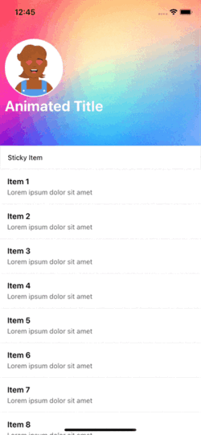
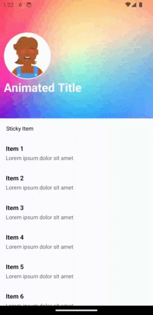
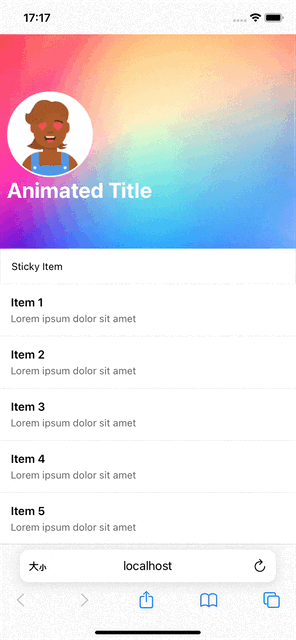

# react-native-animated-header-flat-list

[](https://www.npmjs.com/package/react-native-animated-header-flat-list)
[](https://www.npmjs.com/package/react-native-animated-header-flat-list)
[](https://www.npmjs.com/package/react-native-animated-header-flat-list)

一个带有动画折叠头部的 React Native FlatList 组件，具有视差效果、平滑标题过渡、粘性组件支持和可自定义样式。使用 TypeScript 构建，并在 Header 中实现了背景层和内容层的分离。

[English](./README.md) | 简体中文

## 预览

<div align="center">
  <table style='width:100%;'>
    <tr>
      <td><h4 align='center'>iOS</h4></td>
      <td><h4 align='center'>Android</h4></td>
      <td><h4 align='center'>Web</h4></td>
    </tr>
    <tr>
      <td></td>
      <td></td>
      <td></td>
    </tr>
  </table>
</div>

## 特性

- 带有视差效果的动画折叠头部
- 标题从 Header 到 NavigationBar 的平滑过渡
- 可选的粘性组件支持
- 完全可自定义的头部和标题样式
- Header 中背景层和内容层的分离
- TypeScript 支持

## 安装

```sh
npm install react-native-animated-header-flat-list
```

## 必需的依赖

本库需要安装以下依赖项：

```sh
npm install @react-navigation/native @react-navigation/native-stack @react-navigation/elements react-native-reanimated react-native-safe-area-context
```

请确保按照每个依赖的安装说明进行操作：

- [React Navigation](https://reactnavigation.org/docs/getting-started)
- [React Native Reanimated](https://docs.swmansion.com/react-native-reanimated/docs/fundamentals/getting-started)
- [React Native Safe Area Context](https://github.com/th3rdwave/react-native-safe-area-context#getting-started)

### 额外配置

对于 React Native Reanimated，需要在 `babel.config.js` 中添加 `react-native-reanimated/plugin` 插件：

```js
module.exports = {
  presets: [
    ... // 不要加在这里 :)
  ],
  plugins: [
    ...
    'react-native-reanimated/plugin',
  ],
};
```

注意：`react-native-reanimated/plugin` 必须放在插件列表的最后面。

## 使用示例

```tsx
import { useNavigation } from '@react-navigation/native';
import type { NativeStackNavigationProp } from '@react-navigation/native-stack';
import { useCallback } from 'react';
import { Image, ImageBackground, StyleSheet, Text, View } from 'react-native';
import { AnimatedHeaderFlatList } from 'react-native-animated-header-flat-list';

export default function HomeScreen() {
  const navigation = useNavigation<NativeStackNavigationProp<any>>();
  const data = Array.from({ length: 50 }, (_, index) => ({
    id: `item-${index}`,
    title: `Item ${index + 1}`,
    description: 'Lorem ipsum dolor sit amet',
  }));
  const title = 'Animated Title';
  const backgroundImageUrl =
    'https://images.unsplash.com/photo-1579546929518-9e396f3cc809';
  const avatarUrl = 'https://api.dicebear.com/7.x/avataaars/png?seed=John';

  const HeaderBackground = useCallback(
    () => (
      <ImageBackground
        source={{ uri: backgroundImageUrl }}
        style={styles.headerBackground}
      />
    ),
    [backgroundImageUrl]
  );

  const HeaderContent = useCallback(
    () => (
      <View style={styles.headerContent}>
        <Image source={{ uri: avatarUrl }} style={styles.avatar} />
      </View>
    ),
    [avatarUrl]
  );

  const StickyComponent = useCallback(
    () => <Text style={styles.stickyComponent}>Sticky Item</Text>,
    []
  );

  const renderItem = useCallback(
    ({
      item,
    }: {
      item: { id: string; title: string; description: string };
    }) => (
      <View style={styles.listItem}>
        <Text style={styles.itemTitle}>{item.title}</Text>
        <Text style={styles.itemDescription}>{item.description}</Text>
      </View>
    ),
    []
  );

  return (
    <AnimatedHeaderFlatList
      navigation={navigation}
      title={title}
      headerTitleStyle={styles.headerTitle}
      navigationTitleStyle={styles.navigationTitle}
      HeaderBackground={HeaderBackground}
      HeaderContent={HeaderContent}
      StickyComponent={StickyComponent}
      data={data}
      renderItem={renderItem}
    />
  );
}

const styles = StyleSheet.create({
  headerBackground: {
    backgroundColor: 'white',
    height: 300,
    width: '100%',
  },
  headerContent: {
    height: 300,
    width: '100%',
  },
  avatar: {
    position: 'absolute',
    top: 80,
    left: 10,
    backgroundColor: 'white',
    width: 120,
    height: 120,
    borderRadius: 60,
    borderWidth: 2,
    borderColor: 'white',
  },
  headerTitle: {
    position: 'absolute',
    top: 200,
    left: 10,
    fontSize: 30,
    fontWeight: 'bold',
    color: 'white',
  },
  navigationTitle: {
    fontSize: 18,
    fontWeight: '600',
    color: 'white',
  },
  stickyComponent: {
    backgroundColor: 'white',
    padding: 15,
    borderWidth: 1,
    borderColor: '#EEEEEE',
  },
  listItem: {
    padding: 15,
    borderBottomWidth: 1,
    borderBottomColor: '#EEEEEE',
    backgroundColor: 'white',
  },
  itemTitle: {
    fontSize: 16,
    fontWeight: '600',
  },
  itemDescription: {
    fontSize: 14,
    color: '#666666',
    marginTop: 4,
  },
});
```

### 属性

| 属性                    | 类型                 | 是否必需 | 描述                                                                 |
| -------------------    | -------------------  | -------- | ------------------------------------------------------------------ |
| `navigation`           | NavigationProp<any>  | 是       | React Navigation 导航属性                                           |
| `title`                | string               | 是       | 在 Header 和 NavigationBar 之间动画过渡的标题文本                      |
| `headerTitleStyle`     | StyleProp<TextStyle> | 否       | Header 标题的样式对象。支持所有 Text 样式属性。位置相对于 HeaderContent   |
| `navigationTitleStyle` | StyleProp<TextStyle> | 否       | NavigationBar 标题的样式对象。支持除位置相关属性外的所有 Text 样式属性     |
| `HeaderBackground`     | React.ComponentType  | 是       | 渲染为 Header 背景的组件                                              |
| `HeaderContent`        | React.ComponentType  | 否       | 渲染在 Header 背景之上的组件。其透明度会根据滚动位置自动动画                |
| `StickyComponent`      | React.ComponentType  | 否       | 可选的粘性组件，会固定在 NavigationBar 下方                             |
| `parallax`             | boolean              | 否       | 启用/禁用头部背景的视差效果。默认为 true                                 |
| `...FlatListProps`     | FlatListProps        | -        | 支持所有标准的 FlatList 属性                                          |

## 贡献

查看[贡献指南](CONTRIBUTING.md)了解如何为该仓库做出贡献以及开发工作流程。

## 许可证

MIT

---

使用 [create-react-native-library](https://github.com/callstack/react-native-builder-bob) 创建 